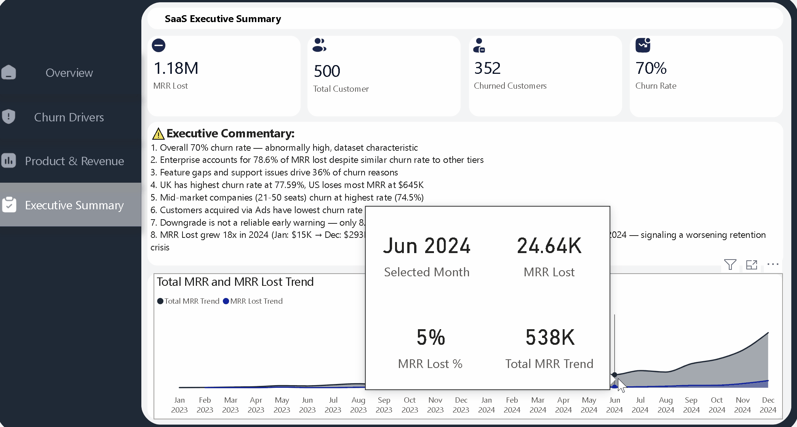

# SaaS Subscription & Churn Analytics

An end-to-end B2B SaaS churn analysis project using **MySQL** for data extraction and **Power BI** for interactive dashboard visualization across 5 relational tables.



---

## Project Overview

This project analyzes customer churn patterns for a fictional B2B SaaS company (RavenStack) — identifying why customers cancel, which segments are most at risk, and where revenue loss is concentrated.

**Dataset:** [RavenStack SaaS Subscription & Churn Analytics (Kaggle)](https://www.kaggle.com/datasets/muhammadshahidazeem/customer-churn-dataset)**Tables:** 5 relational tables — accounts, subscriptions, feature_usage, support_tickets, churn_events  
**Total Records:** 500 accounts · 4,853 subscriptions · 25,068 feature usage records · 2,000 support tickets · 600 churn events  
**Tools:** MySQL Workbench · Power BI Desktop · Microsoft Excel  
**Scope:** January 2023 – December 2024

---

## Business Questions

1. Which plan tier has the highest churn rate and most revenue loss?
2. What are the most common reasons customers are leaving?
3. What is the average satisfaction score for churned vs retained customers?
4. What percentage of customers with low satisfaction scores eventually churned?
5. Which country is losing the most customers and revenue?
6. Does using certain features reduce churn?
7. Do customers who complain more churn more?
8. Do new customers churn more than long-term ones?
9. Do customers who downgrade eventually churn?
10. Does high error count in feature usage lead to higher churn?
11. Which industry has the highest churn rate?
12. Which referral source produces the most loyal customers?
13. Which company size has the highest churn rate?

---

## Key Findings

### Overall Churn
- **Overall Churn Rate: 70%** — 352 out of 500 accounts churned (note: abnormally high; reflects synthetic dataset construction)
- **Total MRR Lost: $1,179,139** across all churned subscriptions

### Plan Tier & Revenue
- Churn rate is nearly identical across all tiers — Enterprise 9.98%, Pro 9.67%, Basic 9.49%
- Despite similar churn rates, **Enterprise accounts for 78.56% of total MRR lost** ($926,345) vs Basic at only 6.15% ($72,523)
- One churned Enterprise customer is worth roughly 12 churned Basic customers in revenue impact

### Churn Reasons
- **Feature gaps (19%) and poor support (17.33%) are the top churn drivers** — accounting for 36% of all churn events combined
- This is a product and support problem, not a pricing problem — Pricing and Competitor reasons combined account for only 30%
- 15.83% of churned customers gave no reason — a data quality gap worth monitoring

### Customer Satisfaction
- Average satisfaction score is identical between churned (3.98) and retained (3.98) customers — satisfaction score alone is a weak churn predictor
- However, **customers at the lowest satisfaction level (3.0/5) churn at 68.9%** — the signal lies in the extremes, not the averages

### Country Performance
- **UK has the highest churn rate at 77.59%** despite being the second largest market
- **US loses the most MRR at $645,721** due to having the largest customer base (291 accounts)
- **Germany is the most stable market** with the lowest churn rate at 56% and lowest MRR lost at $44,111

### Support & Engagement
- Support ticket volume shows no meaningful difference between churned (4.02 avg tickets) and retained (4.17) customers
- Feature usage frequency does not differentiate churned from retained customers — all 40 features show nearly identical average usage counts
- **Error count does not predict churn** — churned (0.57 avg errors) vs retained (0.56) are virtually identical

### Company Size & Acquisition
- **Mid-market companies (21-50 seats) churn at the highest rate (74.5%)** while large companies (50+ seats) are the most stable at 64.86%
- **Customers acquired via Ads have the lowest churn rate at 60.2%** — paid acquisition produces more loyal customers than organic or partner referrals
- Partner and Organic referrals churn at 75%+ — counterintuitive and worth investigating

### Downgrade & Tenure
- **Downgrade is not a reliable early warning signal** — only 8.83% of churned customers downgraded before cancelling; 91.17% cancelled directly
- Customer tenure shows no meaningful difference between churned (30.1 months) and retained (30.1 months) customers

### Revenue Trend
- MRR Lost accelerated sharply through 2024 — from $15,829 in January 2024 to $293,548 in December 2024 (18x increase)
- By Q4 2024, nearly 13% of monthly MRR was being lost to churn — a worsening retention crisis requiring immediate intervention

---

## Dashboard Pages

| Page | Description |
|------|-------------|
| **Overview** | KPI cards, MRR Lost by Plan Tier, Churn Rate by Referral Source, Churn Rate by Country map |
| **Churn Drivers** | Top churn reason KPI, churn reasons bar chart, satisfaction score distribution, downgrade impact donut |
| **Product & Revenue** | Country KPIs, MRR Lost and Churn Rate by Country combo chart, Churn Rate by Company Size, Plan Tier analysis |
| **Executive Summary** | 8-point executive commentary, MRR vs MRR Lost trend chart (Jan 2023 – Dec 2024) |

---

## SQL Analysis

All 13 business questions were answered using MySQL before building the dashboard. See [`SQL_ANALYSIS.md`](SQL_ANALYSIS.md) for all queries.

**Techniques used:** `GROUP BY`, `ORDER BY`, `COUNT()`, `SUM()`, `ROUND()`, `AVG()`, `CASE WHEN`, `UNION ALL`, `Subqueries`, `Window Functions (SUM() OVER())`, Multi-table `JOIN`s across 5 relational tables

---

## Data Limitations

- **70% overall churn rate is abnormally high** for a real SaaS company (industry average is 5-10% annually). This dataset is synthetic and constructed for analytical purposes — findings should be interpreted in that context.
- **Satisfaction score data is incomplete** — 825 out of 2,000 support ticket records (41.25%) contained empty satisfaction scores and were excluded from satisfaction analysis.
- **Churn_flag inconsistency** — `churn_flag` in the subscriptions table does not perfectly align with accounts appearing in churn_events, reflecting a data integrity limitation in the synthetic dataset.
- **Single company dataset** — all 500 accounts belong to one fictional SaaS company (RavenStack). Findings cannot be generalized across industries.

---

## Repository Structure

```
SaaS-Subscription-Churn-Analytics/
│
├── SaaS_Dashboard.pbix          # Power BI dashboard file
├── SQL_ANALYSIS.md              # All 13 SQL queries with result screenshots
├── README.md                    # Project documentation
└── images/                      # SQL result grid screenshots directory

```
---

## Connect

[](https://www.linkedin.com/in/quratulain-siddiqui)
[](https://github.com/Quratulain-qurat97)
[](https://www.fiverr.com/quratulain0097)
[](mailto:qurat33002@gmail.com)

---

**Author:** Quratulain Tariq  
**Last Updated:** July 2026
