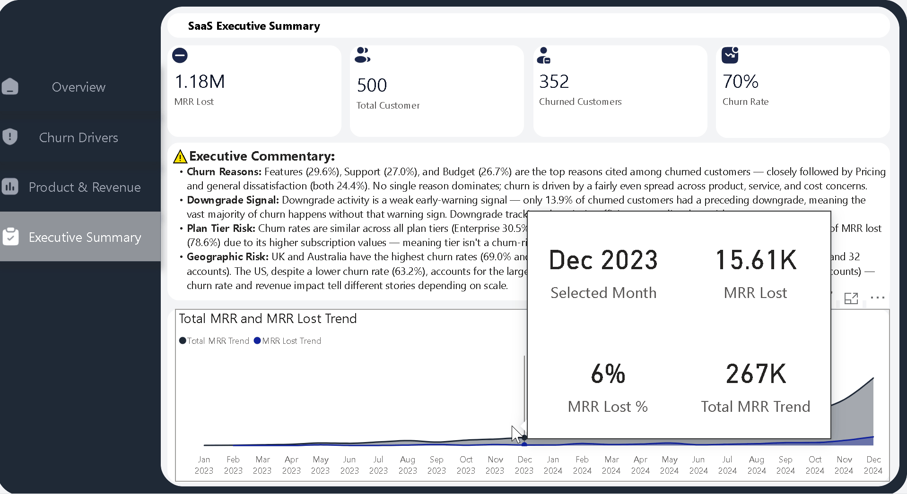

# 🚀 SaaS Subscription & Churn Analytics

## An End-to-End B2B SaaS Retention Analysis Project



---

## 📊 Executive Summary (30-Second Read)

**The Problem:** RavenStack is experiencing a severe retention crisis with **70% overall churn** and MRR Lost accelerating **18x in 2024** (from $15K to $293K monthly).

**The Root Causes:**
1. **Feature gaps (29.6%)** and **support issues (27.0%)** are the top-cited reasons among churned customers — closely followed by budget, pricing, and general dissatisfaction (all 24-27%). No single reason dominates.
2. **Enterprise tier** accounts for **78.6%** of revenue loss ($926K), despite churning at a similar *rate* to other tiers (Enterprise 30.5%, Pro 29.7%, Basic 27.5%)
3. **UK and Australia** have the highest churn rates (**68.97%** and **68.75%**), though on relatively small account bases
4. **Mid-market companies (21-50 seats)** churn at the highest rate among group sizes (**74.5%**)

**The Recommendations:**
1. **Immediate:** Investigate UK/Australia market operations and Enterprise feature gaps
2. **Short-term:** Address product roadmap to close feature gaps and support issues driving over half of churn reasons combined
3. **Long-term:** Build early warning system combining satisfaction extremes and downgrade signals
---


**Dataset:** [RavenStack SaaS Subscription & Churn Analytics (Kaggle)](https://www.kaggle.com/datasets/muhammadshahidazeem/customer-churn-dataset)  
**Tables:** 5 relational tables — accounts, subscriptions, feature_usage, support_tickets, churn_events  
**Total Records:** 500 accounts · 4,853 subscriptions · 25,068 feature usage records · 2,000 support tickets · 600 churn events  
**Tools:** MySQL Workbench · Power BI Desktop · Microsoft Excel  
**Scope:** January 2023 – December 2024

---

## 🎯 Business Questions

| # | Question |
|---|----------|
| 1 | Which plan tier has the highest churn rate and most revenue loss? |
| 2 | What are the most common reasons customers are leaving? |
| 3 | What is the avg satisfaction score for churned vs retained customers? |
| 4 | What % of low-satisfaction customers eventually churned? |
| 5 | Which country is losing the most customers and revenue? |
| 6 | Does using certain features reduce churn? |
| 7 | Do customers who complain more churn more? |
| 8 | Do new customers churn more than long-term ones? |
| 9 | Do customers who downgrade eventually churn? |
| 10 | Does high error count in feature usage lead to higher churn? |
| 11 | Which industry has the highest churn rate? |
| 12 | Which referral source produces the most loyal customers? |
| 13 | Which company size has the highest churn rate? |

---

## 🔍 Key Findings

### 💰 Revenue Impact
- **Overall Churn Rate: 70%** — 352 out of 500 accounts churned
- **Total MRR Lost: $1,179,139**
- **MRR Lost grew 18x in 2024** — from $15,829 in January to $293,548 in December

### 📊 Plan Tier Analysis
- Churn rate is genuinely similar across all tiers — **Enterprise 30.5%, Pro 29.7%, Basic 27.5%**
- Enterprise accounts for **78.6% of total MRR lost** ($926,345) — driven by higher subscription value, not higher churn risk
- *Note: accounts may hold subscriptions across multiple plan tiers simultaneously; tier-level totals will not sum to the overall customer count*

### 🎯 Churn Reasons (Top 6)

| Reason | Accounts | % of Churned Customers |
|--------|----------|------------------------|
| Features | 104 | 29.55% |
| Support | 95 | 26.99% |
| Budget | 94 | 26.70% |
| Pricing | 86 | 24.43% |
| Unknown | 86 | 24.43% |
| Competitor | 79 | 22.44% |

> **Key Takeaway:** Churn is driven by a fairly even spread across product, service, and cost concerns — no single reason dominates. *Percentages don't sum to 100%, since customers may cite multiple reasons.*

### 🌍 Geographic Performance


| Country | Accounts | Churn Rate | MRR Lost |
|---------|----------|------------|----------|
| UK | 58 | 68.97% (Highest) | — |
| Australia | 32 | 68.75% | — |
| France | 22 | 63.64% | — |
| US | 291 | 63.23% | $645,721 (Highest) |
| Canada | 23 | 60.87% | — |
| Germany | 25 | 52.00% | — |
| India | 49 | 51.02% (Lowest) | — |

> **Key Takeaway:** UK and Australia have the highest churn *rates*, but on small account bases. The US, despite a lower rate, drives the largest MRR loss due to its much larger customer base — rate and revenue impact tell different stories.
> 
### 👥 Customer Segmentation

| Company Size | Churn Rate |
|-------------|------------|
| 21-50 seats (Mid-Market) | 74.50% (Highest) |
| 6-20 seats | 69.15% |
| 1-5 seats | 69.05% |
| 50+ seats (Large) | 64.86% (Lowest) |

### 📈 Acquisition Channel Loyalty

| Source | Churn Rate |
|--------|------------|
| Partner | 75.28% |
| Organic | 74.56% |
| Other | 70.87% |
| Event | 70.83% |
| **Ads** | **60.20% (Most Loyal)** |

### ⚠️ Downgrade Analysis

- Only **13.9%** of churned customers had a preceding downgrade — the vast majority churned without that warning sign
- Downgrade tracking alone is **not sufficient** to predict churn risk
- **Recommendation:** Don't rely on downgrade activity as your primary early-warning signal
- *Note: ~30 accounts show conflicting downgrade-flag data across churn events; figures reflect each account counted once per applicable flag value*

### ❌ What Does NOT Predict Churn
- Satisfaction Score (churned: 3.98 vs retained: 3.98)
- Support Ticket Volume (churned: 4.02 vs retained: 4.17)
- Feature Usage Frequency (identical across all 40 features)
- Error Count (churned: 0.57 vs retained: 0.56)
- Customer Tenure (churned: 30.1 months vs retained: 30.1 months)

> **The signal lies in the extremes, not the averages** — customers at the lowest satisfaction level (3.0/5) churn at 68.9%

---

## 📊 Dashboard Pages

| Page | Visualizations |
|------|---------------|
| **Overview** | KPI Cards, MRR Lost by Plan, Churn Rate by Referral, Country Map |
| **Churn Drivers** | Top Churn Reason, Churn Reasons Bar Chart, Satisfaction Distribution, Downgrade Impact |
| **Product & Revenue** | Country KPIs, MRR Lost & Churn Rate Combo, Company Size Analysis, Plan Tier Analysis |
| **Executive Summary** | Executive Commentary, MRR vs MRR Lost Trend (Jan 2023–Dec 2024) |

**Features:** Interactive bookmarks · Custom tooltips · KPI cards · Combo charts · Map visualization

---

## 🛠️ Technical Skills Demonstrated

| Skill Area | Techniques |
|------------|------------|
| **SQL** | Window Functions, Subqueries, CASE WHEN, Multi-table JOINs, Dynamic Bucketing, UNION ALL |
| **Power BI** | DAX Measures, Custom Tooltips, Bookmarks, KPI Cards, Combo Charts, Map Visualizations |
| **Data Analysis** | Churn Rate Calculation, MRR Trend Analysis, Cohort Segmentation, Null Result Documentation |
| **Data Modeling** | 5-Table Relational Schema, Table Relationships, Data Cleansing, Null Handling |
| **Storytelling** | Executive Commentary, Actionable Recommendations, Data Limitations Documentation |

---

## 📁 SQL Analysis

All 13 business questions were answered using MySQL before building the dashboard. See **[SQL_ANALYSIS.md](SQL_ANALYSIS.md)** for all queries with result screenshots.

**Techniques used:** `GROUP BY`, `ORDER BY`, `COUNT()`, `SUM()`, `ROUND()`, `AVG()`, `CASE WHEN`, `UNION ALL`, Subqueries, Window Functions (`SUM() OVER()`), Multi-table JOINs across 5 relational tables

---

## ⚠️ Data Limitations

| Issue | Impact |
|-------|--------|
| 70% churn rate is abnormally high | Not representative of real SaaS (industry avg: 5-10% annually) |
| 41.25% missing satisfaction scores | Satisfaction analysis excludes incomplete records |
| Churn_flag inconsistency | Does not perfectly align with churn_events table |
| Single company dataset | Findings cannot be generalized across industries |

---

## 📈 Business Recommendations

### 🔴 Immediate (Next 30 Days)
1. **UK & Australia Market Investigation:** Conduct customer interviews with UK & Australia churned accounts (68.97% & 68.75% churn rate — highest globally)
2. **Enterprise Success Team:** Dedicate senior CSMs to Enterprise accounts (78.6% of MRR loss)
3. **Feature Gap Audit:** Identify the top missing features driving 29.6% of all churned customers

### 🟡 Short-Term (Next 90 Days)
4. **Product Roadmap Review:** Feature gaps and support issues are the two most-cited churn reasons (29.6% and 27.0% of churned customers respectively) — closely followed by budget, pricing, and general dissatisfaction, all in the 24-27% range. No single fix will solve this; a product and support quality review addresses the two largest, most controllable drivers.
5. **Mid-Market Retention Program:** Targeted campaign for 21-50 seat companies (74.5% churn rate)
6. **Ads Channel Expansion:** Paid acquisition produces the most loyal customers (60.2% churn vs 75%+ organic)

### 🟢 Long-Term (Next 6-12 Months)
7. **Early Warning System:** Build alert system for customers at satisfaction extremes (3.0/5 → 68.9% churn rate)
8. **Revenue Trend Monitoring:** Track monthly MRR Lost % to measure intervention effectiveness
9. **Referral Program Review:** Investigate why partner and organic referrals churn at 75%+ vs Ads at 60.2%

---

## 🚀 Getting Started

### Prerequisites
- MySQL Workbench 8.0+
- Power BI Desktop
- Microsoft Excel

### Setup Instructions
1. Clone this repository
2. Download the dataset from [Kaggle](https://www.kaggle.com/datasets/muhammadshahidazeem/customer-churn-dataset)
3. Import all 5 CSV files into MySQL Workbench as separate tables
4. Run the SQL queries in `SQL_ANALYSIS.md` to validate the data
5. Open `SaaS_Dashboard.pbix` in Power BI Desktop

---

## 📁 Repository Structure

```
SaaS-Subscription-Churn-Analytics/
│
├── SaaS_Dashboard.pbix          # Power BI dashboard file
├── SaaS_Churn.gif               # Dashboard preview
├── README.md                    # Project documentation
├── SQL_ANALYSIS.md              # All 13 SQL queries with result screenshots
└── images/                      # SQL result grid screenshots
    ├── Q1.png
    ├── Q2.png
    ├── Q3.png
    ├── Q4.png
    ├── Q5.png
    ├── Q6.png
    ├── Q7.png
    ├── Q8.png
    ├── Q9a.png
    ├── Q9b.png
    ├── Q10.png
    ├── Q11.png
    ├── Q12.png
    └── Q13.png
```

---

## 📬 Connect

[](https://www.linkedin.com/in/quratulain-siddiqui)
[](https://github.com/Quratulain-qurat97)
[](https://www.fiverr.com/quratulain0097)
[](mailto:qurat33002@gmail.com)

---

**Author:** Quratulain Tariq  
**Last Updated:** July 2026

---

*"Data doesn't tell stories — analysts do."* 🚀
