# SQL Analysis & Result Grids

This document contains the complete set of 13 MySQL queries used to extract, aggregate, and analyze data for the RavenStack SaaS Churn project, accompanied by visual result grids from the database.

---


### Query 1: Highest Churn Rate and Revenue Loss by Plan Tier
```sql
Select plan_tier,
COUNT(*) AS Subcription,
SUM(CASE WHEN churn_flag='True' THEN 1 ELSE 0 END) AS Churn_count,
ROUND(SUM(CASE WHEN churn_flag='True' THEN 1 ELSE 0 END)/COUNT(*)*100,2) AS churn_rate_pct,
SUM(CASE WHEN churn_flag='True' THEN mrr_amount ELSE 0 END) AS mrr_lost,
ROUND(SUM(CASE WHEN churn_flag='True' THEN mrr_amount ELSE 0 END)/
SUM(SUM(CASE WHEN churn_flag='True' THEN mrr_amount ELSE 0 END)) OVER() *100,2) AS mrr_lost_pct
FROM ravenstack_subscriptions
GROUP BY plan_tier
ORDER BY mrr_lost_pct DESC;
```
**Result Grid:**
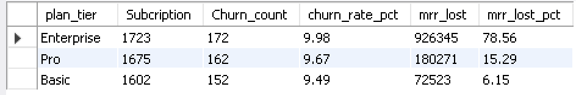

---


### Query 2: Most Common Reasons Customers are Leaving
```sql
SELECT reason_code,
COUNT(reason_code) AS reason_count,
ROUND(COUNT(reason_code) / (SELECT COUNT(*) FROM ravenstack_churn_events)*100, 2) AS reason_count_pct
FROM ravenstack_churn_events
GROUP BY reason_code
ORDER BY reason_count DESC;
```
**Result Grid:**
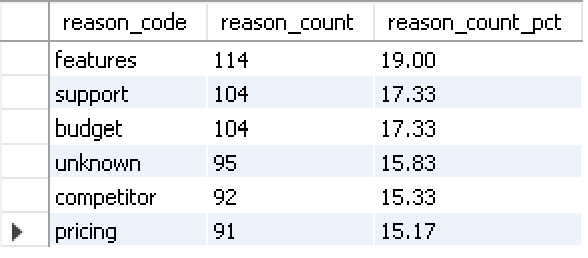

---


### Query 3: Average Satisfaction Score for Churned vs Retained Customers
```sql
SELECT  
CASE WHEN e.account_id IS NULL THEN 'Retained' ELSE 'Churned' END AS customer_status,
ROUND(AVG(CAST(st.satisfaction_score AS DECIMAL(3,1))), 2) AS avg_satisfaction_score,
COUNT(DISTINCT st.account_id) AS customer_count
FROM ravenstack_support_tickets st
LEFT JOIN ravenstack_churn_events e ON st.account_id = e.account_id
WHERE st.satisfaction_score IS NOT NULL 
AND st.satisfaction_score != ''
GROUP BY customer_status;
```
**Result Grid:**
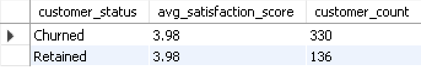

---


### Query 4: Percentage of Customers with Low Satisfaction Scores Who Eventually Churned
```sql
SELECT 
ROUND(COUNT(DISTINCT e.account_id) / COUNT(DISTINCT st.account_id) * 100, 2) AS churn_percentage_low_satisfaction
FROM ravenstack_support_tickets st
LEFT JOIN ravenstack_churn_events e ON st.account_id = e.account_id
WHERE st.satisfaction_score = (
SELECT MIN(satisfaction_score) 
FROM ravenstack_support_tickets 
WHERE satisfaction_score IS NOT NULL
);
```
**Result Grid:**
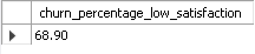

---


### Query 5: Country Losing the Most Customers and Revenue
```sql
SELECT 
a.country,
SUM(s.mrr_amount) AS mrr_lost
FROM ravenstack_subscriptions s
JOIN ravenstack_accounts a ON s.account_id = a.account_id
WHERE s.churn_flag = 'True'
GROUP BY a.country
ORDER BY mrr_lost DESC;
```
**Result Grid:**
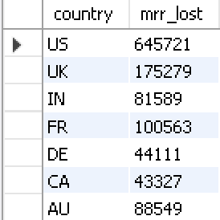

---


### Query 6: Feature Usage vs Churn Impact
```sql
SELECT 
f.feature_name,
CASE WHEN e.account_id IS NULL THEN 'retained' ELSE 'churned' END custumer_status,
ROUND(AVG(f.usage_count),2) AS average_user_count
from ravenstack_feature_usage f
JOIN ravenstack_subscriptions s
ON f.subscription_id=s.subscription_id
LEFT JOIN ravenstack_churn_events e
ON s.account_id=e.account_id
GROUP BY f.feature_name,custumer_status
ORDER BY average_user_count DESC;
```
**Result Grid:**
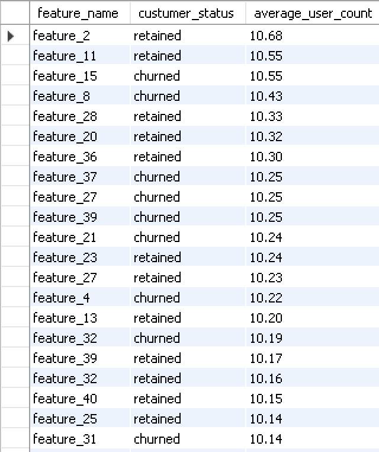

---


### Query 7: Support Ticket Volume (Complain Frequency) vs Churn
```sql
SELECT 
'Churned' AS customer_status,
COUNT(ticket_id) AS total_tickets,
COUNT(DISTINCT account_id) AS distinct_accounts,
ROUND(COUNT(ticket_id) / COUNT(DISTINCT account_id), 2) AS avg_tickets_per_customer
FROM ravenstack_support_tickets
WHERE account_id IN (
SELECT DISTINCT account_id 
FROM ravenstack_churn_events
)
UNION ALL
SELECT 
'Retained' AS customer_status,
COUNT(ticket_id) AS total_tickets,
COUNT(DISTINCT account_id) AS distinct_accounts,
ROUND(COUNT(ticket_id) / COUNT(DISTINCT account_id), 2) AS avg_tickets_per_customer
FROM ravenstack_support_tickets
WHERE account_id NOT IN (
SELECT DISTINCT account_id 
FROM ravenstack_churn_events
);
```
**Result Grid:**
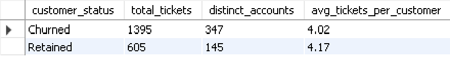

---


### Query 8: Customer Tenure Analysis (New vs Long-term)
```sql
SELECT 
CASE WHEN e.account_id IS NULL THEN 'Retained' ELSE 'Churned' END AS customer_status,
ROUND(AVG(DATEDIFF(CURDATE(), STR_TO_DATE(a.signup_date, '%Y-%m-%d'))/30), 1) AS avg_tenure_months
FROM ravenstack_accounts a
LEFT JOIN ravenstack_churn_events e ON a.account_id = e.account_id
GROUP BY customer_status;
```
**Result Grid:**
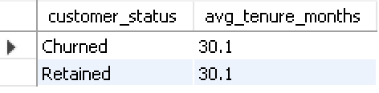

---


### Query 9a: Downgrade Status Analysis
```sql
SELECT 
downgrade_flag,
COUNT(*) AS Total_customers,
SUM(CASE WHEN downgrade_flag='True' THEN 1 ELSE 0 END) AS churned_count,
ROUND(SUM(CASE WHEN downgrade_flag='True' THEN 1 ELSE 0 END)/COUNT(*)*100,2) AS churn_rate_pct
FROM ravenstack_subscriptions
GROUP BY downgrade_flag
ORDER BY churned_count DESC;
```
**Result Grid:**
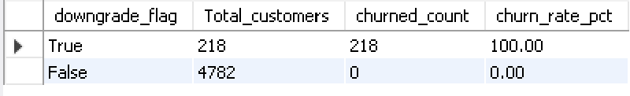

---


### Query 9b: Preceding Downgrade Flag Analysis
```sql
SELECT 
preceding_downgrade_flag,
COUNT(*) AS churn_count,
ROUND(COUNT(*) / (SELECT COUNT(*) FROM ravenstack_churn_events) * 100, 2) AS pct_of_churns
FROM ravenstack_churn_events
GROUP BY preceding_downgrade_flag;
```
**Result Grid:**
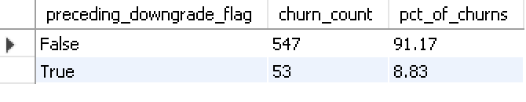

---


### Query 10: Feature Error Count vs Churn Lead
```sql
SELECT
CASE WHEN e.account_id IS NULL THEN 'Retained' ELSE 'Churned' END AS customer_status,
ROUND(AVG(f.error_count), 2) AS avg_error_count,
SUM(f.error_count) AS total_errors,
COUNT(DISTINCT s.account_id) AS customer_count
FROM ravenstack_feature_usage f
JOIN ravenstack_subscriptions s ON f.subscription_id = s.subscription_id
LEFT JOIN ravenstack_churn_events e ON e.account_id = s.account_id
GROUP BY customer_status;
```
**Result Grid:**
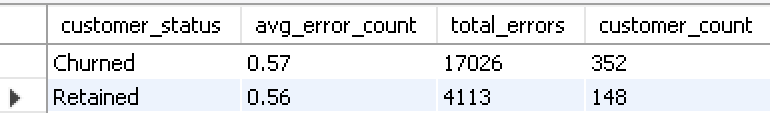

---


### Query 11: Industry Churn Rate Breakdown
```sql
SELECT 
a.industry,
COUNT(DISTINCT a.account_id) AS total_accounts,
COUNT(DISTINCT e.account_id) AS churned_accounts,
ROUND(COUNT(DISTINCT e.account_id) / COUNT(DISTINCT a.account_id) * 100, 2) AS churn_rate
FROM ravenstack_accounts a
LEFT JOIN ravenstack_churn_events e ON a.account_id = e.account_id
GROUP BY a.industry
ORDER BY churn_rate DESC;
```
**Result Grid:**
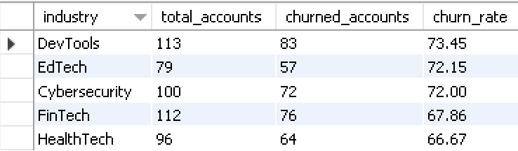

---


### Query 12: Referral Source Loyalty Analysis
```sql
SELECT 
a.referral_source,
COUNT(DISTINCT a.account_id) AS total_accounts,
COUNT(DISTINCT e.account_id) AS churned_accounts,
ROUND(COUNT(DISTINCT e.account_id) / COUNT(DISTINCT a.account_id) * 100, 2) AS churn_rate
FROM ravenstack_accounts a
LEFT JOIN ravenstack_churn_events e ON a.account_id = e.account_id
GROUP BY a.referral_source
ORDER BY churn_rate DESC;
```
**Result Grid:**
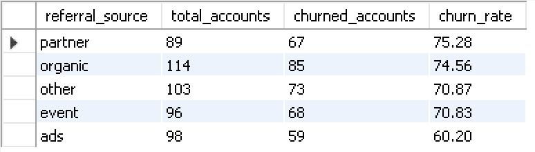

---


### Query 13: Company Size Churn Rate Breakdown
```sql
SELECT 
CASE 
WHEN seats <= 5 THEN '1-5 seats'
WHEN seats <= 20 THEN '6-20 seats'
WHEN seats <= 50 THEN '21-50 seats'
ELSE '50+ seats'
END AS company_size,
COUNT(DISTINCT a.account_id) AS total_accounts,
COUNT(DISTINCT e.account_id) AS churned_accounts,
ROUND(COUNT(DISTINCT e.account_id) / COUNT(DISTINCT a.account_id) * 100, 2) AS churn_rate
FROM ravenstack_accounts a
LEFT JOIN ravenstack_churn_events e ON a.account_id = e.account_id
GROUP BY company_size
ORDER BY churn_rate DESC;
```
**Result Grid:**
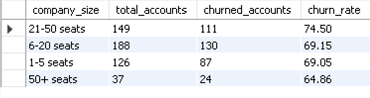

---
